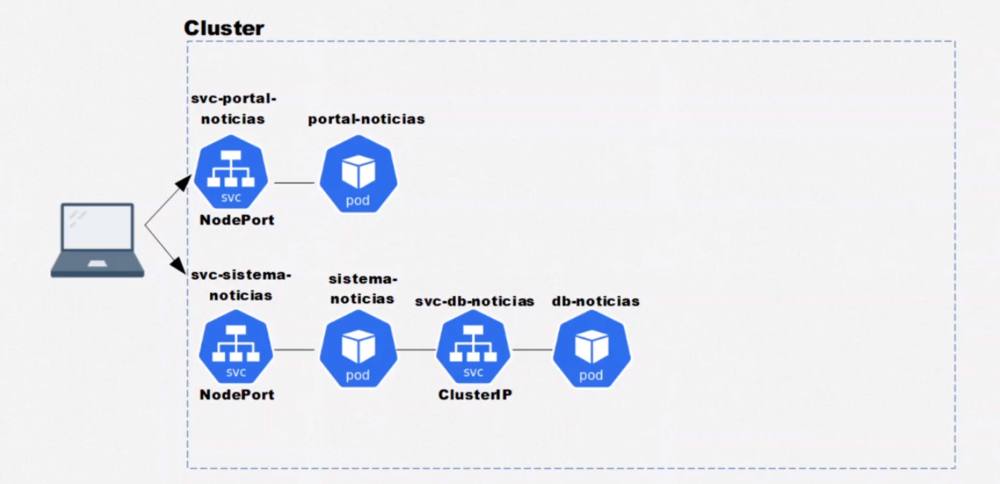

# Curso de Kubernetes: Deployments, Volumes e Escalabilidade

Este é um guia para o curso de Kubernetes focado em implantações, volumes e escalabilidade. Foi abordado os conceitos básicos e avançados do Kubernetes, juntamente com exemplos práticos e uso de várias ferramentas e recursos.

## Tópicos Abordados:

1. **Pods:**
   - Um conceito fundamental do Kubernetes, que representa a menor unidade computacional. Os Pods podem conter um ou mais containers.

2. **Cluster IP:**
   - Endereço IP interno atribuído a um serviço para comunicação interna dentro do cluster.

3. **Services (Svc):**
   - Serviços no Kubernetes ajudam a expor os aplicativos em execução em um conjunto de Pods como uma rede. Eles abstraem a lógica de acesso aos Pods subjacentes.

4. **Portas (Port):**
   - As portas são os pontos finais de comunicação em um serviço Kubernetes. Eles são especificados na definição do serviço e roteiam o tráfego para os Pods apropriados.

5. **Type:**
   - Tipo de serviço em Kubernetes. Pode ser `ClusterIP`, `NodePort`, `LoadBalancer`, ou `ExternalName`.

6. **TCP/IP:**
   - Protocolo fundamental da Internet usado para comunicação entre sistemas.

7. **NodePort:**
   - Tipo de serviço que expõe o serviço em um porto estático em cada nó do cluster. Pode ser acessado externamente usando `<NodeIP>:<NodePort>`.

8. **Kubectl:**
   - Ferramenta de linha de comando do Kubernetes para interagir com clusters Kubernetes.

9. **LoadBalancer:**
   - Tipo de serviço que provisiona automaticamente um balanceador de carga externo para expor o serviço para a Internet.

10. **Banco de Dados (BD):**
    - Exemplo de aplicação que pode ser implantada e escalada usando Kubernetes.

11. **Variáveis de Ambiente:**
    - Valores dinâmicos que podem ser passados para dentro de um contêiner para personalizar seu comportamento.

12. **ConfigMap:**
    - Um objeto Kubernetes para armazenar dados de configuração em um formato de chave-valor.

13. **Env:**
    - Uma maneira de injetar variáveis de ambiente em contêineres Kubernetes.

## Exemplo de Uso:

Para demonstrar como esses conceitos são aplicados na prática, aqui está um exemplo de implantação de uma aplicação de banco de dados usando Kubernetes:

1. Crie um Deployment YAML que descreve a aplicação do banco de dados, especificando a imagem do contêiner, portas expostas e variáveis de ambiente para configuração.
   
2. Defina um Service YAML para expor o banco de dados dentro do cluster, especificando o tipo como `ClusterIP`.

3. Configure um ConfigMap YAML para armazenar os dados de configuração do banco de dados, como credenciais de acesso e configurações.

4. Use o `kubectl` para aplicar esses arquivos YAML ao cluster Kubernetes.

5. Para escalabilidade, você pode atualizar o número de réplicas no Deployment YAML para lidar com picos de tráfego ou aumentar a capacidade de armazenamento do banco de dados conforme necessário.

